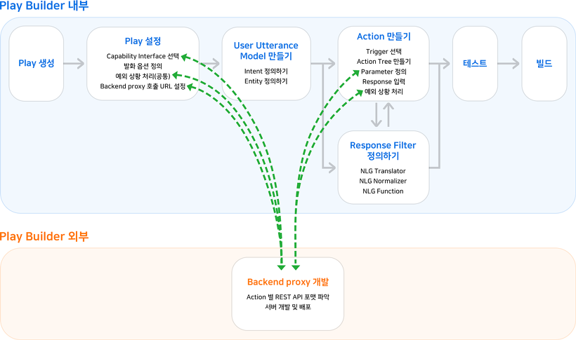
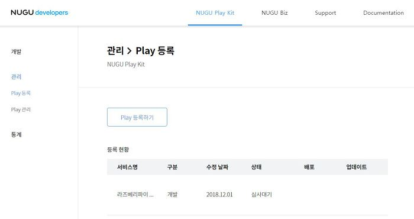
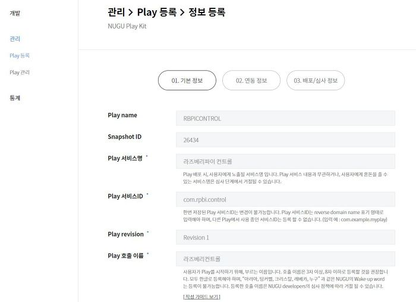
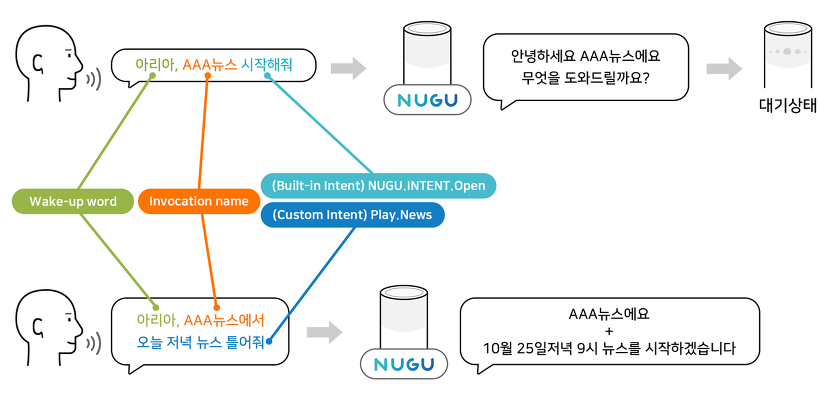
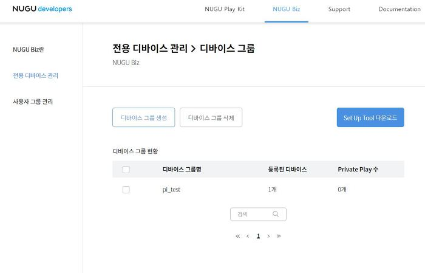

# NUGU 스피커로 라즈베리파이 불 켜고끄기
지금까지는 컴퓨터상에서 서비스를 개발하고 테스트를 진행하였습니다.
이제 내가 만든 서비스를 누구스피커와 연동하여 테스트를 진행하겠습니다.

테스트 및 Play 등록
--
Play가 제대로 동작하는지 테스트하는 방법은 크게 두 가지입니다.

- Play Builder에서 채팅으로 테스트
- NUGU 디바이스(스피커)에서 음성으로 테스트

Play Builder에서 채팅으로 테스트하는 방법은 Play Builder를 통해 직접 학습시킨 Intent에 대해 어떻게 분석이 되고 어떻게 동작하는지 확인할 수 있는 테스트입니다.
NUGU 디바이스(스피커)와 연동하여 진행하는 테스트는 실제 사용자에게 제공될 서비스 그대로를 점검할 수 있는 테스트입니다. 
이 테스트는 NUGU Play Kit에서 사용할 NUGU 디바이스를 등록해야 합니다.

세부방법은 가이드페이지를 참고바랍니다.
 - [테스트 세부방법](https://developers-doc.nugu.co.kr/nugu-play/create-plays-with-play-builder/test-a-play)
 
 테스트 준비가 완료되면 이제 작성한 라즈베리파이 컨트롤 Play를 등록합니다.
 
 
 
 - 01 라즈베리파이 컨트롤 Play 등록
 
  
  
  
 - 02 Play 등록시 제일 중요한 포인트는 "Play 호출 이름" 입니다. 개인이 만든 서비스를 시작하는 이름으로 스피커에서 테스트 시 "아리아, 라즈베리컨트롤 시작" 이라고 발화하여 서비스가 작동되게 합니다.

 

실습하기
--
아리아, 라즈베리컨트롤 시작 
라즈베리에서 LED 밝게해줘!
 
 
NUGU Biz 이용하기
--
NUGU Biz는 NUGU Play Kit에서 만든 Private Play를 전용의 디바이스 또는 특정 사용자 그룹만 사용할 수 있도록 관리하는 기능입니다.
NUGU Biz를 이용하여 나의 스피커를 등록하고 내가 만든 서비스를 연동시킬 수 있습니다.
즉 내가 만든 서비스를 나만의 스피커에서 활용 할 수 있습니다. (모든사용자에게도 배포도 가능합니다.)

- [나의 NUGU스피커를 NUGU Biz에 등록하기](https://developers-doc.nugu.co.kr/nugu-play/work-with-nugu-biz)

스피커 등록
--
- 01 가이드 문서를 참고하여 나의 스피커를 등록합니다.
 

- 02 전용 디바이스를 등록합니다.

